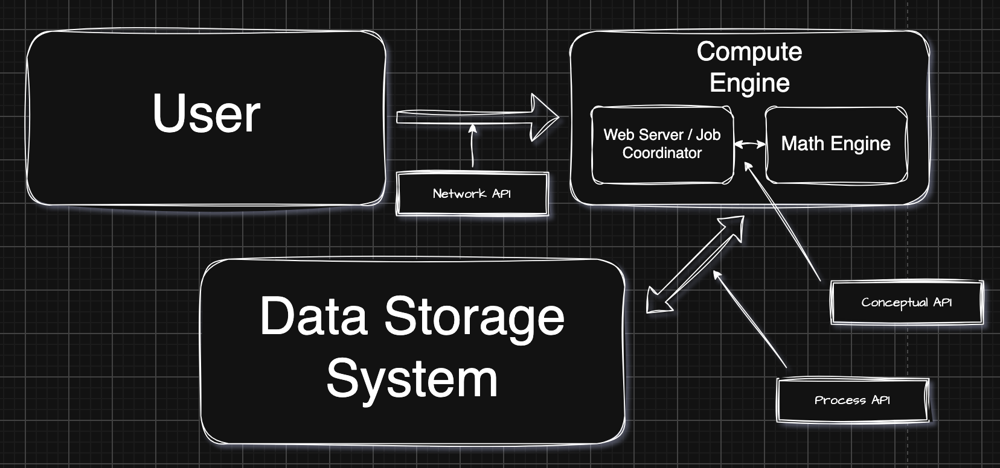

# Gabriella's Compute Engine
**The compute engine will work towards prime factorization of a certain input n.** N will be continuously divided by prime candidates of 2 up to the square root of N to decompose N into its prime numbers.

***An example of how this compute engine will function:***
N = 84
Output = 2, 2, 3, 7 (2 * 2 * 3 * 7)

## Systems Design Diagram

